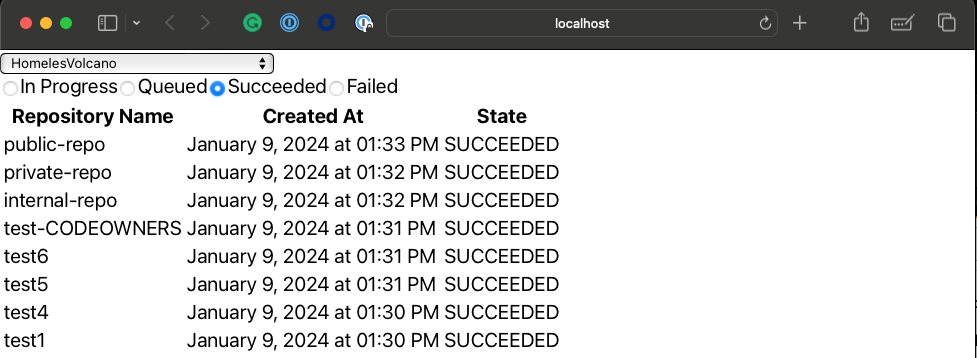

# GitHub Migration Dashboard

This app will show a Repository Migrations dashboard for GitHub Cloud migrations when using the [GitHub Enterprise Importer](https://docs.github.com/en/migrations/using-github-enterprise-importer/understanding-github-enterprise-importer/about-github-enterprise-importer) CLI



## Configuration

Set the environment variables in the `.env` before running

```
REACT_APP_GITHUB_PAT=""
REACT_APP_GITHUB_ENTERPRISE_NAME=""
```

Note: `REACT_APP_GITHUB_PAT` must have permission to the Organization and must be already SSO approved if SSO is activated.

## Install App

In the project directory, you can run:

### `npm install`

## Start App

In the project directory, you can run:

### `npm start`

Runs the app in the development mode.\
Open [http://localhost:3000](http://localhost:3000) to view it in your browser.

The page will reload when you make changes.\
You may also see any lint errors in the console.